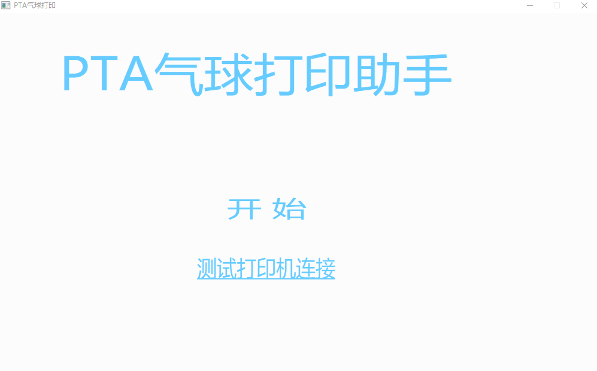

# PTA气球打印程序

用于获取PTA、洛谷平台比赛时的排行榜并生成数据送入小票机

# 配置

### 环境要求
需要以下python库
1. json
2. requests
3. codecs

需要一台电脑并且连接用于打印气球小票的打印机
`该打印机需要设置为默认打印机`（设置->蓝牙和其他设备->打印机和扫描仪->选择对应打印机设置即可）
实验室使用的是得力热敏票据打印机

连接完成后运行PTA文件夹内的`PTA气球打印.exe`，点击测试打印机连接，如果打印机已经成功连接上电脑，那么将会打印一张带有打印机成功连接信息的小票。

需要保证运行`PTA气球打印.exe`的文件夹下存在`print_info`文件夹和`print_log`文件夹.

运行后已经发过的气球信息会生成一个dic0.json，防止同一个人重复发气球，以上两个文件夹可忽略
（所以每次比赛结束后将dic0.json删除）




然后需要配置`get_balloon.py`
请修改代码文件的以下部分：
题目颜色、题目名字、比赛id，以及以下这一块信息
```python
headers = {
        'Cookie': '__client_id=e39e9a64402ba3cab7042d3d8c6d0caa4c06fa18; _uid=858510; C3VK=5ffe62',   #管理员账号下的信息
        'User-Agent': 'Mozilla/5.0 (Windows NT 10.0; Win64; x64) AppleWebKit/537.36 (KHTML, like Gecko) Chrome/99.0.4844.84 Safari/537.36 HBPC/12.1.3.310',
        'X-Requested-With': 'XMLHttpRequest'
    }
```

PTASession在气球网页界面F12查看cookies可以看到

以及题目数量和希望题目对应的气球颜色，在config文件夹下有constest_problem.json内有气球信息，无视即可，按照get_balloon.py为准
（其余内容不用修改）

最后运行`PTA气球打印.exe`点击开始即可开始监控比赛的气球状态

# 操作界面
包括前端的GUI和后端的控制台窗口

控制台窗口主要用于在程序遇到问题（网络访问失败之类的异常）时输出错误信息方便进行测试

前端的GUI窗口可以暂停当前的打印，来进行纸张的更换
点击暂停键暂停，之后点击继续键继续打印。结束键退出程序（虽然直接关闭程序窗口就可以结束了OwO）


# 其他

程序使用的是电脑的打印机，所以暂时无法同时连接两个打印机即用来进行代码打印又用来进行气球小票打印（会打印到同一个默认打印机去QAQ）

source文件夹内的`GUI.cpp`是`PTA气球打印.exe`的C++源代码，用到了EGE的图像处理库，可以修改cpp文件并重新编译以修改气球小票的打印格式。`No_GUI.cpp`则没有用到图像库，可以直接编译。

（测试血泪教训:普通的c++编译平台无法生成更新后的应用程序，新生成的应用程序才是修改后的，dev可以直接生成，其他可能需要借助Qt等前端开发平台）
## `print_info`文件夹下的`printer.txt`的文件格式

#### 格式如下：

文件的第一行是字符串  `BALLOON_STATUS` 用于标记文件是否是合法的

接下来，每一个要打印的气球占7行，每一行分别是

```
第1行、要打印的气球的id（通过获取api返回的数据得到，每个气球的id都是唯一且不一样的）
第2行、队伍的名称
第3行、队伍的座位
第4行、通过的题目的编号
第5行、气球的颜色
第6行、是否为首A，True则表示是首A，打印时会额外标注；False表示不是，打印时不会有额外信息
第7行、分割行，这一行可以用任何字符串分隔，也可以选择留空行
```

文件的末尾不可以有空行（最后一个气球的分割行是空行的情况除外），也就是说合法的`printer.txt`的行数一定是 _7x + 1_ 行

以下是一个合法的文件示例：
```
BALLOON_STATUS
1234567
是一个队伍
SEAT-332
A
红色
True
-----------
144567
不是一个队伍
SEAT-233
B
绿色
False
------------
```

此外，要注意文件必须是ANSI格式的（C++的文件输入流的原因）

修改get_balloon.py获取的气球的来源，使输出满足上述要求后也可以把本程序用于打印其他比赛平台的气球。
